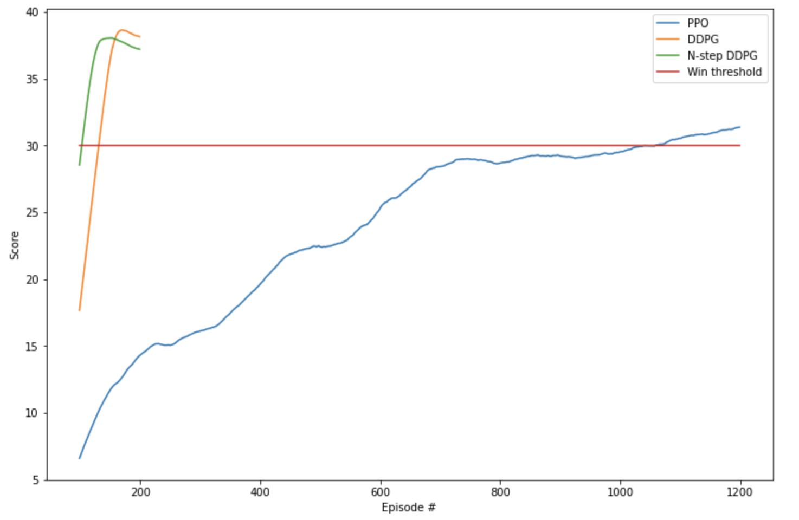

# Reacher

This repository contains a collection of agents for environments with continuous action spaces. The environment considered is a robotic arm with 2 joints operating in a 3D space. A moving target rotates around the arm and the goal of the arm is to maintain its end inside the target. At each step the agents action is made of the torque applied to each of its joint along 2 axis. For each step spent within target, the agent receives a reward of 0.1. Each episode lasts 1000 steps.

Our implementation contains:
- a PPO agent (based on https://arxiv.org/pdf/1506.02438.pdf)
- a DDPG agent (based on https://arxiv.org/pdf/1509.02971.pdf)
- a variation of the DDPG agent including n-step bootsrapping

We train 20 agents in parallels and compare the performance of those different implementations. The best performance is obtained with the n-step DDPG, solving the environment in ~25 episodes.

## Installing the repo

If you don't have it already, install [conda](https://docs.conda.io/en/latest/miniconda.html) and create a dedicated python environment
> conda create --name reacher python=3.6

Activate the environment
> conda activate reacher

From the root folder of the repo, install the python requirements

> pip install -r requirements.txt

## Setup the environment

Download depending on your system:
- Linux: click [here](https://s3-us-west-1.amazonaws.com/udacity-drlnd/P2/Reacher/Reacher_Linux.zip)
- Mac OSX: click [here](https://s3-us-west-1.amazonaws.com/udacity-drlnd/P2/Reacher/Reacher.app.zip)
- Windows (32-bit): click [here](https://s3-us-west-1.amazonaws.com/udacity-drlnd/P2/Reacher/Reacher_Windows_x86.zip)
- Windows (64-bit): click [here](https://s3-us-west-1.amazonaws.com/udacity-drlnd/P2/Reacher/Reacher_Windows_x86_64.zip)

Unzip the environment

## Running the models

Open jupyter lab (or other python notebook client you favour), open solution_walkthrough.ipynb and point it to the environment file in the second cell. You can now run the full notebook.

## Limitations

The repository was developed and tested on Mac OSX. Should you face compatibility issues on other system let us know.
Warning: the environment itself can be quite whimsical and stop answering under certain conditions. We found that restarting the notebook kernel solved some of these issues.